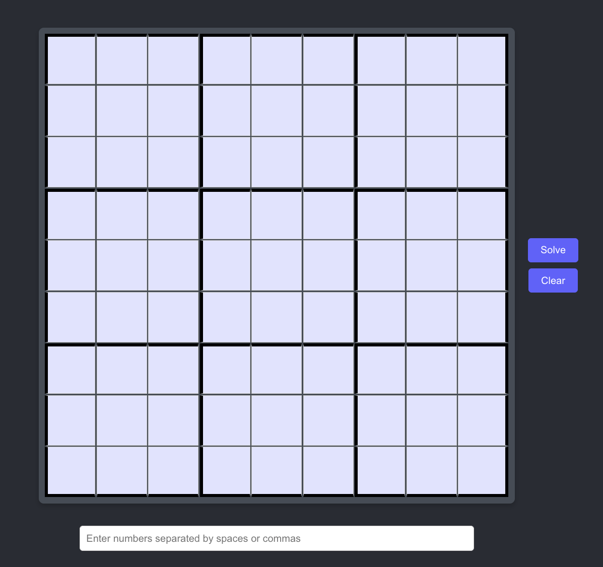
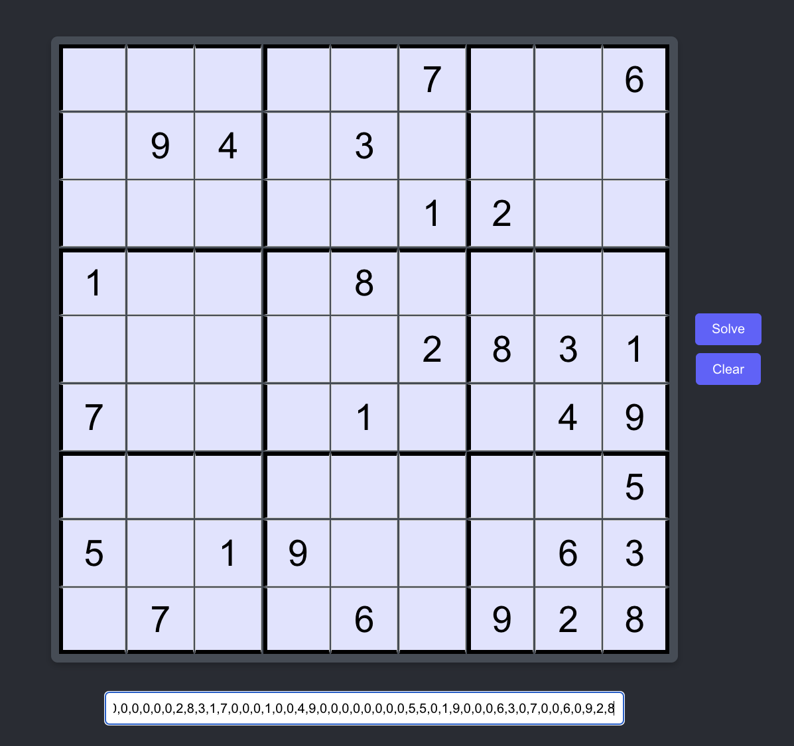
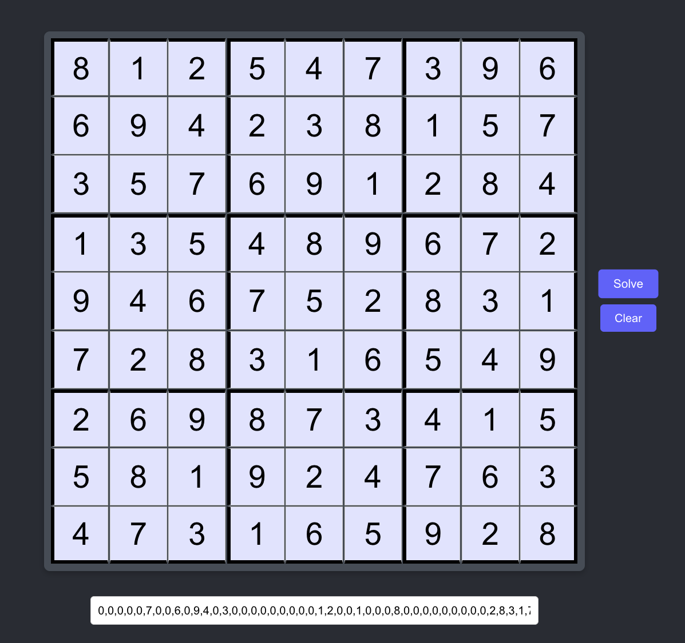

# MasterSudoku

A Sudoku solver web application that uses human-like solving algorithms to solve puzzles step-by-step. Built with Django REST Framework and React, MasterSudoku can handle puzzles of varying difficulty levels from easy to nearly impossible.

## Features

- **Interactive Grid Interface**: Click on cells or use keyboard input to enter numbers
- **Bulk Input**: Enter entire puzzles via comma or space-separated values
- **Human-Like Solving**: Uses advanced algorithms that mimic human solving strategies
- **Multiple Difficulty Levels**: Handles puzzles from easy to expert level
- **Real-time Solving**: Instant puzzle solving via REST API

## Screenshots

### Empty Board

*Clean 9x9 grid ready for puzzle input*

### Unsolved Puzzle

*Puzzle entered and ready to be solved*

### Solved Puzzle

*Complete solution generated by the algorithm*

## Technology Stack

### API
- **Django 5.0.6** - Web framework
- **Django REST Framework** - API development
- **Python** - Core logic and algorithms
- **SQLite** - Database (development)

### Client  
- **React 18** - User interface
- **Axios** - HTTP client for API communication
- **CSS3** - Styling and responsive design

## Getting Started

### Prerequisites

- Python 3.8+ 
- Node.js 14+
- npm or yarn

### Local Development Setup

#### 1. Clone the Repository
```bash
git clone <repository-url>
cd mastersudoku
```

#### 2. API Setup (Django)
```bash
# Navigate to api directory
cd api

# Create and activate virtual environment
python3 -m venv sudoku-env
source sudoku-env/bin/activate

# Install Python dependencies
pip install -r requirements.txt

# Run database migrations
python3 manage.py migrate

# Start the Django development server
python3 manage.py runserver
```

The API will be available at `http://localhost:8000`

#### 3. Client Setup (React)
```bash
# Navigate to client directory (in new terminal)
cd client

# Install Node.js dependencies
npm install

# Set environment variable for API URL
echo "REACT_APP_API_URL=http://localhost:8000" > .env

# Start the React development server
npm start
```

The client will be available at `http://localhost:3000`

#### 4. Test the Application

1. Open your browser to `http://localhost:3000`
2. Enter a Sudoku puzzle by clicking cells or using the bulk input field
3. Click "Solve" to see the solution
4. Use "Clear" to reset the grid

### Sample Puzzle for Testing
Enter the following in the bulk input field:
```
5,3,0,0,7,0,0,0,0,6,0,0,1,9,5,0,0,0,0,9,8,0,0,0,0,6,0,8,0,0,0,6,0,0,0,3,4,0,0,8,0,3,0,0,1,7,0,0,0,2,0,0,0,6,0,6,0,0,0,0,2,8,0,0,0,0,4,1,9,0,0,5,0,0,0,0,8,0,0,7,9
```
Or use the puzzles in the api/example_puzzles.txt file.

## Project Structure

```
mastersudoku/
├── api/                       # Django REST API
│   ├── backend/               # Django project configuration
│   │   ├── settings.py        # Django settings
│   │   ├── urls.py           # URL routing
│   │   └── wsgi.py           # WSGI application
│   ├── puzzles/              # Main application
│   │   ├── utils/sudoku/     # Core Sudoku logic
│   │   │   ├── puzzle.py     # Puzzle and Cell classes
│   │   │   ├── solver.py     # Solving algorithms
│   │   │   └── examples/     # Sample puzzle files (easy.py, hard.py, etc.)
│   │   ├── views.py          # API endpoints
│   │   ├── models.py         # Database models
│   │   └── urls.py           # App URL patterns
│   ├── requirements.txt      # Python dependencies
│   ├── example_puzzles.txt   # Sample puzzles for testing
│   └── manage.py            # Django management script
├── client/                   # React application
│   ├── public/              # Static files
│   ├── src/
│   │   ├── components/
│   │   │   ├── Sudoku.js    # Main puzzle component
│   │   │   └── Sudoku.css   # Component styling
│   │   ├── App.js           # Root component
│   │   └── index.js         # Entry point
│   └── package.json         # Node.js dependencies
├── CLAUDE.md                 # Claude Code guidance
└── README.md
```

## Solving Algorithms

MasterSudoku implements solving strategies that mirror human problem-solving approaches:

### Core Techniques

1. **Naked Singles** (`find_naked_clues(n=1)`): Identifies cells with only one possible value
2. **Hidden Singles** (`find_hidden_clues(n=1)`): Finds values that can only go in one cell within a row, column, or box
3. **Naked Pairs/Triples** (`find_naked_clues(n=2,3)`): Eliminates possibilities when multiple cells share the same limited options
4. **Hidden Pairs/Triples** (`find_hidden_clues(n=2,3)`): Identifies cells that exclusively contain certain values
5. **Intersection Elimination** (`find_inline()`): Removes possibilities based on box-line interactions

### Advanced Strategy

- **Nishio Method**: An advanced guess-and-check algorithm used as a last resort for extremely difficult puzzles. It systematically tests hypotheses and backtracks when contradictions are found.
